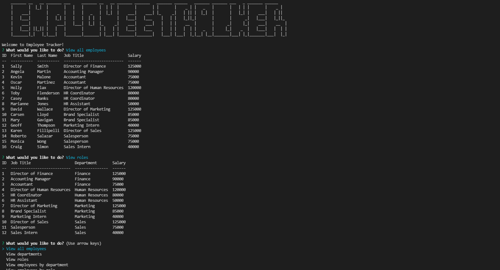

# Employee Tracker

  ## Table of Contents
  - [Description](#description)
  - [Installation Instructions](#installation-instructions)
  - [Usage Information](#usage-information)
  - [Questions?](#questions)

  ## Description
  This is a Node command line app that uses a MySQL database to store, add, and update data regarding employees at a company.
  ## Installation Instructions
  Download the repository from Github. To use MySQL, download MySQL and the workbench from their website. You'll also need to install the npm packages Inquirer, MySQL2, and Console.Table for the app to run properly.
  ## Usage Information
  Use by opening the app in your VS Code terminal, navigating to the correct directory, and enter "node tracker.js" to begin the program. Navigate through the app using the arrow keys and entering text when prompted.
  

  ## Questions?
  Find me on github at gleeson-emily.

  ASCII art generated at [patorjk.com](https://patorjk.com/software/taag/#p=display&f=Graffiti&t=Type%20Something%20).

